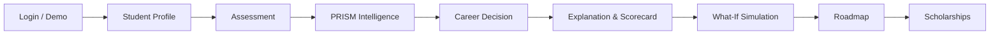

# PRISM — Career Decision Intelligence Platform

> **"PRISM doesn't just recommend a career. It determines how realistically a student can reach it."**  
> *We don't optimize for the perfect career on paper. We optimize for the best achievable career path for the individual.*

---

## 1. What is PRISM?

**PRISM** is an explainable **Career Decision Intelligence Platform** designed to bridge the gap between student aspirations, academic capabilities, family financial boundaries, and real-world employment markets.

Rather than acting as a traditional questionnaire that outputs an abstract personality archetype, PRISM evaluates multi-dimensional real-world constraints to determine the **true feasibility** of each career trajectory and provides a concrete, milestone-driven execution plan.

---

## 2. The Problem

Conventional career counseling and quiz tools fail students and parents in several critical ways:

- **Hypothetical Interest Matching**: Most career quizzes match students based on surface-level interests without verifying foundational aptitude or prerequisite skills.
- **Resource Blindness**: Traditional platforms ignore family financial constraints, tuition costs, and debt limits, assuming unlimited financial resources.
- **Geographic Disconnect**: Recommendations overlook local ecosystem strengths, regional hiring hubs, and student relocation constraints.
- **Black-Box Scoring**: Users receive an opaque score or generic job list with zero explanation as to *why* one path was chosen over another.
- **No Actionability**: Students are left without an actionable roadmap, prerequisite bridging plan, or scholarship access.

---

## 3. The PRISM Solution

PRISM integrates 6 core dimensions of real-world intelligence:

1. **Student Profile & Baseline**: Academic track, location, and verified foundational metrics.
2. **Comprehensive Assessment**: Psychometric interests, cognitive aptitude, technical skills, and preferences.
3. **Multi-Factor Scoring Engine**: Deterministic weighted evaluation across Academic Fit, Skill Readiness, Interest Alignment, Market Demand, Financial Feasibility, and Location Viability.
4. **Transparent Explainability**: Unvarnished rationale explaining why the top career won and why alternative options ranked lower.
5. **Interactive What-If Simulation**: Dynamic sandbox allowing students to model the impact of improving skills or adjusting budgets before committing.
6. **Actionable Roadmap & Scholarships**: Step-by-step educational milestones, entrance exam mapping, and targeted scholarship matching.

---

## 4. Core Product Journey

The application follows a complete, unbroken end-to-end journey:



1. **Login**: Secure production Firebase Authentication with an isolated, instant Hackathon Demo mode.
2. **Profile**: Input basic academic, regional, and family educational budget details.
3. **Assessment**: Complete multi-factor cognitive, technical, and interest evaluations.
4. **PRISM Intelligence Engine**: Evaluates careers against constraints and scores feasibility.
5. **Career Decision**: Recommends the optimal, achievable career pathway.
6. **Explanation & Scorecard**: Reviews the 7-dimension Decision Scorecard, unvarnished Reality Check, and dynamic rationales.
7. **What-If Simulation**: Live sensitivity testing of skills, math foundations, and education budgets.
8. **Roadmap**: Semester-by-semester milestone progression from foundational learning to industry entry.
9. **Scholarships**: Targeted financial aid and bridge scholarships to resolve detected tuition gaps.

---

## 5. Key Differentiators

| Feature | Description |
| :--- | :--- |
| **Career Decision Scorecard** | Evaluates Academic Fit, Skill Readiness, Interest Alignment, Market Demand, Financial Feasibility, Location Feasibility, and Overall Reality Score with dynamic bottleneck verdicts. |
| **Why This Career?** | 2–4 dynamic, evidence-based bullet points derived directly from student assessment strengths, verified aptitude, and market demand. Never hardcoded. |
| **Why NOT Other Careers?** | Quantifies factor differentials (e.g., `-18% Skill Readiness`, `Tuition Gap of ₹...`) for alternative ranks (#2, #3), explicitly showing why they fell behind. |
| **What Would It Take?** | 5-stage sequential transformation pipeline: `Current Reality → Main Gap → Required Improvement → Achievable Path → Target Career`. |
| **⚡ Highest-Impact Action** | Highlights the single highest-leverage bottleneck, the underlying constraint, the immediate corrective action, and projected impact. |
| **Career Reality Check** | Side-by-side audit separating verified **Good Signals** from real-world **Current Risks**, concluded by an honest **PRISM Reality Verdict**. |
| **Decision Confidence** | Dynamic indicator (`HIGH` / `MEDIUM` / `LOW`) with an evidence rationale derived from data completeness and signal consistency. |
| **Career Resilience** | Evaluates trajectory stability (`HIGH` / `MODERATE` / `LOW`) under budget shifts, skill acquisition pace, and industry trends. |
| **Constraint-Aware Optimization**| Categorizes achievable educational pathways into *Traditional*, *Cost-Optimized*, or *Location-First* pathways based on family budget bounds. |

---

## 6. System Architecture

```
[ Frontend: React 19 + Vite + Tailwind CSS ]
                      │
           (HTTP / JSON REST APIs)
                      │
                      ▼
[ Backend: FastAPI Server (Port 8000) ] ──── [ Market API (Port 8001) ]
         │                        │
         ▼                        ▼
[ AI / PRISM Engine ]   [ Decision Intelligence ]
         │                        │
         └───────────┬────────────┘
                     ▼
             [ MongoDB Local ]
```

- **Frontend Client** (`http://localhost:5173`): Single-page React application powered by Vite, Tailwind CSS, and Lucide icons.
- **Main Backend API** (`http://localhost:8000`): FastAPI application handling student profiles, assessment submissions, AI engine orchestration, decision intelligence enrichment, and roadmap services.
- **Market Intelligence API** (`http://localhost:8001`): Dedicated service exposing hyper-local job demand across 7 Indian industrial hubs and 12 STEAM career paths.
- **PRISM AI Scoring Engine** (`ai_engine/`): Deterministic multi-dimensional evaluation calculating Student Fit, Market Fit, and Financial Feasibility without black-box hallucination.
- **Database** (`localhost:27017`): MongoDB instance storing persistent profiles, assessments, parents, and analysis runs.

---

## 7. Technology Stack

- **Frontend**: React 19, Vite 8, Tailwind CSS 4, Lucide React, clsx, tailwind-merge.
- **Backend**: Python 3.10+, FastAPI, Uvicorn, Pydantic v2, PyMongo, python-dotenv.
- **AI & Analytics**: PRISM Deterministic Matching Engine, Decision Intelligence Synthesis Layer.
- **Authentication**: Firebase Admin SDK (Production) + Local Sandbox Session Handler (Demo Mode).
- **Testing**: Pytest, HTTPX, FastAPI TestClient.
- **Database**: MongoDB.

---

## 8. Repository Structure

```
PRISM-Engine-main/
├── ai_engine/                   # PRISM Core Multi-Dimensional Scoring Engine
│   ├── matcher.py               # CareerMatcher & deterministic fit algorithms
│   ├── market_fit_evaluator.py  # Market demand & geographic signal evaluation
│   ├── pipeline.py              # End-to-end analysis orchestration pipeline
│   └── student_fit_evaluator.py # Academic, aptitude, and skill gap scoring
├── assessment/                  # Assessment definitions & psychometric questions
├── backend/                     # FastAPI Application
│   ├── database/                # MongoDB connection manager
│   ├── dependencies/            # Auth guards & ownership verification (IDOR protection)
│   ├── models/                  # Pydantic schemas (Student, Parent, Assessment)
│   ├── routes/                  # API Routers (auth, student, assessment, analyze, roadmap, demo)
│   ├── services/                # Database services & Decision Intelligence engine
│   ├── main.py                  # Main API entrypoint (Port 8000)
│   └── market_main.py           # Market data API entrypoint (Port 8001)
├── data/                        # STEAM Career dataset & baseline benchmarks
├── examples/                    # Sample API requests and response schemas
├── frontend/                    # Vite + React Client
│   ├── src/
│   │   ├── components/          # Reusable UI (CareerExplanation, WhatIf, Scorecard, Sidebar, Header)
│   │   ├── context/             # AuthContext (Firebase + Demo Session)
│   │   ├── pages/               # DashboardPage, RecommendationsPage, ProfilePage, AssessmentPage, DemoPage
│   │   ├── App.jsx              # Application router & navigation state
│   │   └── index.css            # Unified Design System tokens & Tailwind styles
│   └── package.json             # Frontend dependencies
├── market_career/               # Hyper-local job market datasets (7 Indian hubs, 12 careers)
├── tests/                       # Automated Pytest suite
│   └── test_engine.py           # 24 PRISM AI Engine validation tests
├── test_auth_security.py        # 4 Security & IDOR verification tests
├── test_decision_intelligence.py# Decision Intelligence multi-constraint tests
├── test_demo_journey.py         # End-to-end user journey integration tests
├── test_dataset.py              # Dataset integrity validation tests
├── requirements.txt             # Python backend dependencies
└── README.md                    # Project documentation
```

---

## 9. Local Setup & Installation

### Prerequisites
- Python 3.10 or higher
- Node.js 18 or higher & npm
- MongoDB running locally on port 27017 (e.g. `mongod` or Docker)

### 1. Clone & Setup Backend
```bash
# Clone the repository
git clone <repository-url>
cd PRISM-Engine-main

# Create and activate a Python virtual environment
python -m venv venv
# Windows:
venv\Scripts\activate
# macOS/Linux:
source venv/bin/activate

# Install backend dependencies
pip install -r requirements.txt
```

### 2. Configure Environment Variables
Copy the template files and fill in values if using production Firebase:
```bash
# Root / Backend
cp .env.example backend/.env

# Frontend
cp frontend/.env.example frontend/.env
```
*(Note: If running in Hackathon Demo Mode, no Firebase keys are required.)*

### 3. Launch Services

#### Terminal 1 — Main API (Port 8000)
```bash
python -m uvicorn backend.main:app --port 8000 --reload
# API Docs: http://127.0.0.1:8000/docs
```

#### Terminal 2 — Market API (Port 8001)
```bash
python -m uvicorn backend.market_main:app --port 8001 --reload
# Market Docs: http://127.0.0.1:8001/docs
```

#### Terminal 3 — Frontend (Port 5173)
```bash
cd frontend
npm install
npm run dev
# Web Application: http://localhost:5173
```

---

## 10. Judge-Friendly Demo Flow

For evaluators and hackathon judges:

1. Open **`http://localhost:5173`**.
2. **Landing Page**: Observe the core philosophy banner, the 11-stage **PRISM Intelligence Flow**, and the **Career Quiz vs PRISM** competitive matrix.
3. Click **"Get Started"** or **"Sign In"**:
   - Enter any demo credentials (e.g., Name: `Alex`, Password: `demo`).
   - Click **"ENTER PRISM"** to enter Hackathon Demo Mode immediately.
4. **Student Profile**: Review or complete academic marks, location (`Chennai`), and family budget (`₹2,50,000`).
5. **Assessment**: Complete the cognitive, skill, and interest questions.
6. **PRISM Recommendations**:
   - Inspect the **Career Decision Scorecard** (7 PRISM dimensions + dynamic bottleneck verdict).
   - Review **Why This Career?** evidence cards.
   - Inspect **Career Reality Check** (Good Signals vs Current Risks + Honest Verdict).
   - View **What Would It Take?** (5-stage sequential transformation pipeline).
   - Review **⚡ Highest-Impact Action** and **Path Optimization**.
   - Review **Why NOT Other Careers?** on ranks #2 and #3 to see explicit factor differentials.
7. **What-If Simulation**: Adjust the coding or math sliders to simulate score changes in real time.
8. **Roadmap & Scholarships**: Click **"Build Your Full Roadmap"** to explore semester milestones and eligible scholarships.

---

## 11. Testing & Verification

All automated tests have been verified with 100% pass rates:

```bash
# 1. Run Core Pytest Suite (AI Engine & Security)
pytest
# Result: 28 passed in 3.50s (24 AI Engine tests + 4 Security tests)

# 2. Run Auth & IDOR Security Test Suite
python test_auth_security.py
# Result: All security tests PASSED [OK] (No Auth: 401/403, Invalid Token: 401, IDOR: 403, Duplicate UID: 409)

# 3. Run Decision Intelligence Multi-Scenario Tests
python test_decision_intelligence.py
# Result: All 4 Scenarios PASSED [OK] (High Tech, Low Readiness, Low Budget, Low Interest)

# 4. Run Full End-to-End Demo Journey Test
python test_demo_journey.py
# Result: [OK] Full PRISM demo journey PASSED (Student → Parent → Assessment → Analyze → Roadmap → What-If)

# 5. Run Dataset Integrity Test
python test_dataset.py
# Result: Total careers: 12, all 10 required careers found, 7 locations verified successfully.

# 6. Verify Frontend Production Build
cd frontend
npm run build
# Result: Built cleanly in 1.75s with zero errors.
```

---

## 12. Security Architecture & Demo Mode Separation

- **Production Security**: The backend includes standard JWT token verification via the Firebase Admin SDK. All student data access is protected by strict ownership checks (`verify_student_ownership`), preventing Insecure Direct Object Reference (IDOR) vulnerabilities.
- **Hackathon Demo Mode**: To ensure uninterrupted evaluation when Firebase keys are unconfigured, PRISM includes a safe sandbox session mode. Demo sessions are stored strictly in client-side storage, labeled as `DEMO MODE`, and never bypass backend security checks for real user accounts.

---

## 13. Known Limitations

- **Geographic Data Density**: Hyper-local demand data is currently calibrated for India's 7 premier industrial and tech hubs (Bengaluru, Chennai, Hyderabad, Pune, Mumbai, Delhi NCR, Coimbatore). For locations outside these hubs, national baseline demand is applied.
- **Institutional Cost Variance**: College tuition estimates represent categorized median values across premier and private universities; specific institution-level fees may vary by annual admission cycle.

---

## 14. License

PRISM is submitted for academic and hackathon evaluation. All rights reserved.
